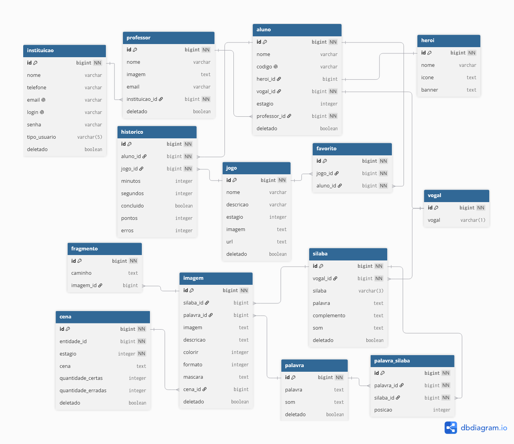

# NinoEdu

Backend do NinoEdu, uma plataforma de jogos digitais voltada à alfabetização de
crianças pelo método ABACADA. A API centraliza o conteúdo pedagógico (vogais,
sílabas, palavras, imagens e áudios) e distribui esse conteúdo de forma dinâmica
para os jogos construídos em Godot, de acordo com o nível de cada aluno.

Este projeto é desenvolvido como Trabalho de Conclusão de Curso (TCC) do curso de
Ciência da Computação da Universidade Estadual do Norte do Paraná (UENP).

---

## Sumário

- [Stack tecnológica](#stack-tecnológica)
- [Estrutura do projeto](#estrutura-do-projeto)
- [Variáveis de ambiente](#variáveis-de-ambiente)
- [Como rodar o projeto](#como-rodar-o-projeto)
- [Modelagem do banco de dados](#modelagem-do-banco-de-dados)
- [Banco de dados, migrations e seed inicial](#banco-de-dados-migrations-e-seed-inicial)
- [Autenticação e autorização](#autenticação-e-autorização)
- [Endpoints da API](#endpoints-da-api)
- [Usando a API no Godot](#usando-a-api-no-godot)
- [Testes automatizados](#testes-automatizados)
- [Importante: segurança temporariamente desativada](#importante-segurança-temporariamente-desativada)
- [Implementações e correções futuras](#implementações-e-correções-futuras)

---

## Stack tecnológica

- Java 21
- Spring Boot
- PostgreSQL 16
- Flyway (versionamento de banco de dados)
- Docker
- Postman (testes de integração)

---

## Estrutura do projeto

O código-fonte do backend está organizado da seguinte forma, dentro de
`backend/src/main/java/com/uenp/ninoedu`:

```
com.uenp.ninoedu
├── controller/       Controllers REST, um por recurso (Silaba, Palavra, Imagem, Cena, etc.)
├── exception/        Exceções customizadas e tratamento centralizado de erros
├── model/
│   ├── dto/          Records de entrada e saída (Request/Response) por recurso
│   ├── entity/       Entidades JPA que mapeiam as tabelas do banco
│   └── enums/        Enumerações do domínio (Estagio, TipoColorir, FormatoImagem, TipoUsuario)
├── repository/       Interfaces Spring Data JPA
├── security/         Configuração de segurança, filtro de autenticação e geração de token
├── services/         Regras de negócio
└── utils/            Conversores JPA (AttributeConverter) para os enums
```

As migrations do banco de dados ficam em `backend/src/main/resources/db/migration`,
seguindo a convenção do Flyway (`V1__`, `V2__`, e assim por diante).

A collection e o environment do Postman ficam em `backend/Postman`. Os testes de
aleatoriedade estatística ficam em `testes_aleatoriedade`, na raiz do repositório.

---

## Variáveis de ambiente

O projeto usa um arquivo `.env` dentro de `backend` para configurar o banco de
dados e o segredo do JWT. Um arquivo `.env.example` está disponível como modelo —
copie-o para `.env` e preencha os valores reais antes de subir o projeto.

| Variável      | Descrição                                                        |
|---------------|--------------------------------------------------------------------|
| `DB_HOST`     | Endereço do banco de dados                                       |
| `DB_PORT`     | Porta do banco de dados (padrão: `5432`)                         |
| `DB_NAME`     | Nome do banco de dados (`NinoEdu`)                                |
| `DB_USERNAME` | Usuário do banco de dados                                        |
| `DB_PASSWORD` | Senha do banco de dados                                          |
| `JWT_SECRET`  | Segredo usado para assinar e validar os tokens JWT                |

O valor de `DB_HOST` depende de como a aplicação é executada:

- Ao rodar o backend localmente (pela IDE ou `mvn spring-boot:run`), com o
  PostgreSQL em um container isolado, use `DB_HOST=localhost`.
- Ao rodar tudo via `docker compose --env-file backend/.env up -d --build`, o `docker-compose.yml` já
  sobrescreve `DB_HOST` para o nome do serviço do banco dentro da rede Docker
  (`postgres`), independentemente do valor definido no `.env`. Não é necessário
  alterar o `.env` para alternar entre os dois cenários.

O `.env` nunca deve ser versionado no repositório. Apenas o `.env.example`, sem
valores sensíveis, deve ser commitado.

---

## Como rodar o projeto

### Requisitos

- [Docker](https://www.docker.com/get-started)
- WSL (Windows Subsystem for Linux), no caso de ambiente Windows

Ao instalar o Docker no Windows, ele solicitará a instalação do WSL
automaticamente. Também é possível instalar manualmente, executando no
PowerShell:

```bash
wsl --install
```

### Estrutura esperada de pastas

Antes de subir o ambiente, verifique se as pastas do repositório estão
organizadas desta forma:

```
ninoedu/
├── docker-compose.yml
├── .env
├── assets/
│   ├── Vogal_A/
│   └── Vogal_O/
├── backend/
└── nginx/
    ├── Dockerfile
    └── nginx.conf
```

### Subindo o ambiente

Clone o repositório:

```bash
git clone https://github.com/RafaelTomazGraciano/ninoedu.git
```

Entre na pasta do projeto:

```bash
cd ninoedu
```

Crie o arquivo `.env` a partir do `.env.example` e preencha os valores.

Suba os containers:

```bash
docker compose --env-file backend/.env up -d --build
```

Na primeira execução esse comando demora alguns minutos, pois o Maven precisa
baixar as dependências e compilar o projeto. A API ficará disponível em
`http://localhost:8080`.

### Comandos úteis

Ver os logs do backend em tempo real:

```bash
docker compose --env-file backend/.env logs -f backend
```

Atualizar apenas o backend após uma mudança no código:

```bash
docker compose --env-file backend/.env up -d --build backend
```

Derrubar o ambiente:

```bash
docker compose --env-file backend/.env down
```

Derrubar o ambiente e apagar os dados do banco, recomeçando do zero:

```bash
docker compose --env-file backend/.env down -v
```

---

## Modelagem do banco de dados

O diagrama abaixo representa o modelo entidade-relacionamento (DER) completo do
banco de dados do NinoEdu:



O modelo é organizado em três grandes grupos:

- **Gestão institucional**: `instituicao`, `professor`, `aluno`, `heroi` — controla
  o acesso de instituições e professores, e o cadastro de alunos, cada um vinculado
  a um herói (avatar) e a um professor.
- **Conteúdo pedagógico**: `vogal`, `silaba`, `palavra`, `palavra_silaba`, `imagem`,
  `fragmento`, `cena` — representa o material didático do método ABACADA. Uma
  imagem pode estar vinculada a uma sílaba, a uma palavra, ou a ambas
  simultaneamente, sempre associada a pelo menos uma das duas.
- **Jogos e progresso**: `jogo`, `favorito`, `historico` — controla os jogos
  disponíveis, quais o aluno favoritou e o histórico de partidas jogadas.

---

## Banco de dados, migrations e seed inicial

O schema do banco é inteiramente controlado por migrations do Flyway, localizadas
em `backend/src/main/resources/db/migration`:

| Migration                              | Responsabilidade                                              |
|-----------------------------------------|-----------------------------------------------------------------|
| `V1__create_initial_schema.sql`         | Criação de todas as tabelas, chaves primárias e estrangeiras     |
| `V2__seed_vogais.sql`                   | Inserção das cinco vogais (A, E, I, O, U)                        |
| `V3__alter_heroi_fk_set_null.sql`       | Ajuste da FK de herói para `ON DELETE SET NULL`                  |
| `V4__insert_games_data.sql`             | Carga de dados de sílabas, palavras, imagens e fragmentos        |

Para reiniciar o banco do zero, incluindo a remoção de todas as migrations já
aplicadas:

```bash
docker compose --env-file backend/.env down -v
docker compose --env-file backend/.env up -d --build
```

### Seed inicial

O Flyway cria o schema e popula o conteúdo pedagógico automaticamente, mas o
usuário administrador precisa ser criado manualmente na primeira execução, pois
a senha precisa estar previamente codificada em BCrypt.

**Cenário 1: banco em container isolado (uso local pela IDE)**

Suba um container de PostgreSQL isolado:

```bash
docker run --name ninoedu-postgres-dev -e POSTGRES_DB=NinoEdu -e POSTGRES_USER=ninoedu -e POSTGRES_PASSWORD=ninoeduPassword -v ninoedu_pgdata:/var/lib/postgresql/data -p 5432:5432 -d postgres:16
```

Inicie a aplicação para que o Flyway crie as tabelas, depois acesse o banco:

```bash
docker exec -it ninoedu-postgres-dev psql -U ninoedu -d NinoEdu
```

**Cenário 2: ambiente completo via Docker Compose**

```bash
docker exec -it ninoedu-postgres sh -c 'psql -U "$POSTGRES_USER" -d "$POSTGRES_DB"'
```

**Em ambos os cenários**, execute o comando SQL abaixo para criar a instituição
administradora. O login é `admin@gmail.com` e a senha é `123456abc` (já
codificada em BCrypt):

```sql
INSERT INTO instituicao (nome, telefone, email, login, senha, tipo_usuario, deletado)
VALUES (
  'Admin',
  '000000000',
  'admin@gmail.com',
  'admin@gmail.com',
  '$2a$12$n6o115PXzjPUo4Efj4kCb.UgOCahI8g/fUem6DYaSNkF3XIg1NmcC',
  'ADMIN',
  false
);
```

Esse usuário é necessário para autenticar as rotas restritas a administradores e
para executar os testes automatizados descritos mais adiante.

---

## Autenticação e autorização

A API utiliza autenticação stateless via JWT. Existem dois fluxos de login,
correspondentes aos dois tipos de usuário do sistema:

- `POST /api/auth/login` — autenticação de Instituição, usando `login` e `senha`.
- `POST /api/auth/aluno/login` — autenticação de Aluno, usando o código único
  gerado no cadastro.

O token retornado deve ser enviado no cabeçalho `Authorization` das requisições
subsequentes, no formato `Bearer <token>`.

Existem dois papéis de usuário, definidos pelo campo `tipo_usuario` da
instituição:

- `ADMIN`: acesso à criação, edição e exclusão de conteúdo pedagógico (sílabas,
  palavras, imagens, cenas, fragmentos, jogos, heróis) e à gestão de instituições.
- `COMUM`: acesso de leitura e às operações do próprio professor/aluno vinculado
  à instituição.

O comportamento atual das regras de autorização está descrito na seção
[Importante: segurança temporariamente desativada](#importante-segurança-temporariamente-desativada).

---

## Endpoints da API

A API roda em `http://localhost:8080`. Os recursos de CRUD (sílabas, palavras,
imagens, cenas, fragmentos, jogos, heróis, instituições, professores, alunos)
seguem o padrão REST convencional (`GET`, `POST`, `PUT`, `DELETE`) e estão
documentados em detalhe na collection do Postman. Os dois endpoints abaixo
merecem destaque por concentrarem a lógica de distribuição de conteúdo para os
jogos.

### `GET /api/recursos/silabas`

Retorna sílabas aleatórias de uma vogal, com suas imagens e áudios, prontas para
uso nos jogos.

**Parâmetros de query:**

| Parâmetro      | Tipo   | Descrição                                                     |
|----------------|--------|------------------------------------------------------------------|
| `vogal`        | string | Vogal desejada. Valores aceitos: `A`, `E`, `I`, `O`, `U`          |
| `limite`       | int    | Quantidade de sílabas a retornar                                 |
| `tipoColorir`  | string | Tipo de imagem para o jogo. Ver tabela abaixo                    |
| `quantImagens` | int    | Quantidade máxima de imagens por sílaba                          |

**Valores de `tipoColorir`:**

| Valor            | Descrição                                                  |
|-------------------|-------------------------------------------------------------|
| `NAO_COLORIR`     | Imagens normais, sem funcionalidade de colorir               |
| `JOGO_COLORIR`    | Imagens com máscara para jogo de colorir                     |
| `CLIQUE_COLORIR`  | Imagens com fragmentos para jogo de clique e colorir         |

**Exemplo de requisição:**

```
GET http://localhost:8080/api/recursos/silabas?vogal=A&limite=3&tipoColorir=NAO_COLORIR&quantImagens=2
```

**Exemplo de resposta:**

```json
[
  {
    "palavra": "BANANA",
    "silaba": "BA",
    "imagens": [
      { "imagem": "http://localhost:3100/assets/Vogal_A/Imagens/Ba_Banana_Foto_1.png" },
      { "imagem": "http://localhost:3100/assets/Vogal_A/Imagens/Ba_Banana_Imagem_1.png" }
    ],
    "som": "http://localhost:3100/assets/Vogal_A/Audios/ba.ogg",
    "complemento_silaba": "_ _NANA"
  }
]
```

### `GET /api/recursos/palavras`

Retorna palavras aleatórias de uma vogal, com suas imagens e as sílabas que as
compõem. Esta rota aceita apenas `tipoColorir=NAO_COLORIR`.

**Parâmetros de query:**

| Parâmetro      | Tipo   | Descrição                                                         |
|----------------|--------|------------------------------------------------------------------|
| `vogal`        | string | Vogal dominante da palavra. Valores aceitos: `A`, `E`, `I`, `O`, `U` |
| `limite`       | int    | Quantidade de palavras a retornar                                 |
| `tipoColorir`  | string | Deve ser sempre `NAO_COLORIR`                                     |
| `quantImagens` | int    | Quantidade máxima de imagens por palavra                          |

**Como a vogal é determinada para uma palavra:**

A vogal filtra palavras cujas sílabas pertencem àquela vogal. A hierarquia de
prioridade é `E > I > U > O > A`, seguindo o método ABACADA. Por exemplo,
`CAVALO` tem sílabas `CA` (vogal A), `VA` (vogal A) e `LO` (vogal O) — portanto
aparece ao buscar pela vogal `O`.

**Exemplo de requisição:**

```
GET http://localhost:8080/api/recursos/palavras?vogal=A&limite=2&tipoColorir=NAO_COLORIR&quantImagens=4
```

**Exemplo de resposta:**

```json
[
  {
    "palavra": "MALA",
    "som": "http://localhost:3100/assets/Vogal_A/AudiosPalavras/mala.ogg",
    "imagens": [
      { "imagem": "http://localhost:3100/assets/Vogal_A/ImagensPalavras/Ma_Mala_Foto_1.png" },
      { "imagem": "http://localhost:3100/assets/Vogal_A/ImagensPalavras/Ma_Mala_Imagem_1.png" }
    ],
    "silabas": [
      { "posicao": 1, "silaba": "MA", "som": "http://localhost:3100/assets/Vogal_A/Audios/ma.ogg" },
      { "posicao": 2, "silaba": "LA", "som": "http://localhost:3100/assets/Vogal_A/Audios/la.ogg" }
    ]
  }
]
```

---

## Usando a API no Godot

O consumo da API no Godot segue um fluxo simples: uma requisição HTTP para um
dos endpoints de recursos, seguida do carregamento das imagens e áudios
referenciados na resposta.

Passos gerais:

1. Crie um nó `HTTPRequest` e faça uma requisição GET para
   `http://localhost:8080/api/recursos/silabas` ou
   `http://localhost:8080/api/recursos/palavras`, com os parâmetros de query
   descritos na seção anterior.
2. No retorno da requisição, use `JSON.parse_string()` para converter o corpo da
   resposta em um array de dicionários.
3. Cada item do array contém URLs de imagem e de áudio. Para cada URL, faça uma
   nova requisição HTTP e converta o resultado com `Image.load_png_from_buffer()`
   (imagens) ou `AudioStreamOggVorbis.load_from_buffer()` (áudios).
4. Recomenda-se armazenar os dados carregados em um script Autoload (Global),
   configurado em `Project > Project Settings > Autoload`. Assim, qualquer cena
   do jogo acessa o conteúdo já carregado sem repetir as requisições.

Como as imagens retornadas por sílaba ou palavra já vêm em quantidade limitada e
em ordem aleatória (ver seção de testes de aleatoriedade), não é necessário
implementar lógica adicional de sorteio no cliente além de embaralhar a ordem de
exibição, se desejado.

---

## Testes automatizados

### Postman

A collection e o environment do Postman estão em `backend/Postman`:

- `NinoEdu.postman_collection.json`
- `NinoEdu Dev.postman_environment.json`

Para importar:

1. Abra o Postman.
2. Arraste os arquivos para dentro da janela do Postman.

Antes de executar os testes, é necessário preencher três variáveis do
environment:

| Variável       | Valor                                                        |
|-----------------|--------------------------------------------------------------|
| `base_url`      | URL da API, por exemplo `http://localhost:8080`               |
| `admin_login`   | Login da instituição administradora criada no seed inicial    |
| `admin_senha`   | Senha da instituição administradora criada no seed inicial    |

As demais variáveis do environment são preenchidas automaticamente pelos
próprios testes durante a execução e não precisam de valor inicial.

Os testes devem ser executados em ordem sequencial, através do Collection
Runner, pois há dependência entre as pastas (por exemplo, a exclusão de uma
sílaba depende de uma sílaba criada anteriormente na collection).

### Testes de aleatoriedade

O diretório `testes_aleatoriedade` contém um script de validação estatística do
mecanismo de seleção aleatória de sílabas e palavras, com testes de diversidade,
cobertura e aderência à distribuição uniforme (Qui-Quadrado). A documentação
completa, incluindo embasamento estatístico e instruções de execução, está em
[`testes_aleatoriedade/README.md`](./testes_aleatoriedade/README.md).

---

## ⚠️ Importante: segurança temporariamente desativada

As regras de autorização por rota, descritas na seção
[Autenticação e autorização](#autenticação-e-autorização), estão atualmente
desativadas para fins de teste. A configuração vigente em
`SecurityConfigurations.java` libera acesso público apenas às rotas de recursos
de jogo, e trata qualquer outra rota autenticada (de qualquer papel, ADMIN ou
COMUM) como suficiente:

```java
.authorizeHttpRequests(authorize -> authorize
        .requestMatchers(HttpMethod.GET, "/api/recursos/**").permitAll()
        .anyRequest().authenticated()
)
```

Isso significa que, no estado atual, qualquer usuário autenticado tem acesso a
operações que deveriam ser restritas a administradores, como criar, editar ou
excluir conteúdo pedagógico e gerenciar instituições.

Antes de qualquer implantação em ambiente de produção, a configuração deve ser
restaurada para a versão abaixo, que restringe corretamente cada rota por papel:

```java
public SecurityFilterChain securityFilterChain(HttpSecurity httpSecurity, SecurityFilter securityFilter) throws Exception {
        return httpSecurity
                .csrf(AbstractHttpConfigurer::disable)
                .cors(cors -> cors.configurationSource(corsConfigurationSource()))
                .sessionManagement(session -> session.sessionCreationPolicy(SessionCreationPolicy.STATELESS))
                .authorizeHttpRequests(authorize -> authorize

                       // ========== ENDPOINTS PÚBLICOS ==========
                       .requestMatchers(HttpMethod.POST, "/api/auth/login").permitAll()
                       .requestMatchers(HttpMethod.POST, "/api/auth/aluno/login").permitAll()
                       .requestMatchers(HttpMethod.GET, "/api/status").permitAll()
                       .requestMatchers("/error").permitAll()

                       // ========== ENDPOINTS APENAS ADMIN ==========
                       .requestMatchers(HttpMethod.POST, "/api/auth/cadastro").hasRole("ADMIN")

                       // Criar/Editar/Deletar Conteúdo do Jogo (ADMIN)
                       .requestMatchers(HttpMethod.POST,
                               "/api/jogos", "/api/herois", "/api/silabas", "/api/palavras",
                               "/api/imagens", "/api/fragmentos", "/api/cenas").hasRole("ADMIN")
                       .requestMatchers(HttpMethod.PUT,
                               "/api/jogos/**", "/api/herois/**", "/api/silabas/**", "/api/palavras/**",
                               "/api/imagens/**", "/api/fragmentos/**", "/api/cenas/**").hasRole("ADMIN")
                       .requestMatchers(HttpMethod.DELETE,
                               "/api/jogos/**", "/api/herois/**", "/api/silabas/**", "/api/palavras/**",
                               "/api/imagens/**", "/api/fragmentos/**", "/api/cenas/**").hasRole("ADMIN")

                        // Gerenciar Instituições (ADMIN)
                        .requestMatchers(HttpMethod.POST, "/api/instituicoes").hasRole("ADMIN")
                        .requestMatchers(HttpMethod.PUT, "/api/instituicoes/**").hasRole("ADMIN")
                        .requestMatchers(HttpMethod.DELETE, "/api/instituicoes/**").hasRole("ADMIN")
                        .requestMatchers(HttpMethod.PATCH, "/api/instituicoes/**").hasRole("ADMIN")

                        // ========== REGRA FINAL / ADMIN E COMUM PODEM ACESSAR ==========
                        .anyRequest().authenticated()
                )
                .addFilterBefore(securityFilter, UsernamePasswordAuthenticationFilter.class)
                .build();
    }
```

## Implementações e correções futuras

Esta seção reúne pontos identificados durante o desenvolvimento que ficaram
deliberadamente fora do escopo atual, mas que ficam como melhorias do projeto.

### Remover configuração de CORS temporária

`SecurityConfigurations.corsConfigurationSource()` inclui atualmente a origem
`https://192.168.122.123`, marcada no próprio código como temporária, para fins
de teste. Deve ser removida antes de qualquer implantação em ambiente de
produção.

### Paginação em todas as listagens

Nem todos os endpoints de listagem retornam dados paginados. `CenaController`
(`GET /api/cenas`) devolve um array completo, sem `Pageable`, diferente do restante 
da API (sílabas, palavras,imagens, fragmentos, jogos), que já usa paginação. Isso é tolerável hoje 
pelo volume pequeno de dados, mas se torna um problema de
performance e de consistência assim que o volume de cenas crescer.
Recomenda-se padronizar `listarTodas()` para devolver `Page<CenaResponseDTO>`,
seguindo o mesmo padrão já usado em `SilabaService`/`PalavraService`.

### Testes unitários da camada de serviço

A cobertura de testes do projeto hoje é inteiramente de integração, via
Postman. Não há testes unitários (JUnit/Mockito) para a camada de `services`.
Testes unitários cobririam regras de negócio isoladamente (por exemplo, as
validações de exclusão que dependem de contagem de registros relacionados) com
execução mais rápida e sem depender de um banco de dados ativo.

### Documentação OpenAPI/Swagger

A collection do Postman documenta os endpoints de forma funcional, mas não há
uma especificação OpenAPI gerada a partir do código (via springdoc-openapi, por
exemplo). Isso manteria a documentação da API sempre sincronizada com o código
e forneceria uma interface interativa (Swagger UI) complementar à collection.

### Unificar o modelo de vínculo de `Cena` com o de `Imagem` ?

A tabela `imagem` foi migrada de um modelo polimórfico (`estagio` + `entidade_id`)
para duas chaves estrangeiras explícitas (`silaba_id`, `palavra_id`).
A tabela `cena` manteve o modelo antigo por decisão consciente, para reduzir o
escopo da mudança na ocasião. Isso deixou duas soluções diferentes para o mesmo
problema (associar um registro a uma sílaba ou a uma palavra) convivendo na
mesma base de código. Vale avaliar aplicar a `cena` a mesma refatoração já
feita em `imagem`?